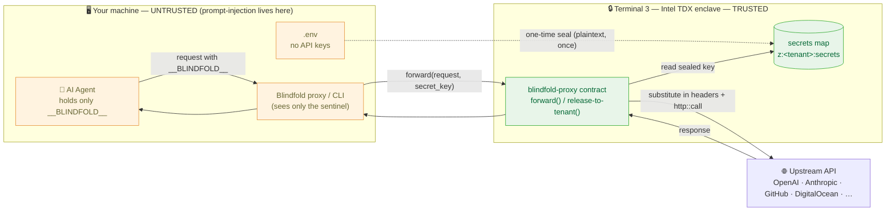
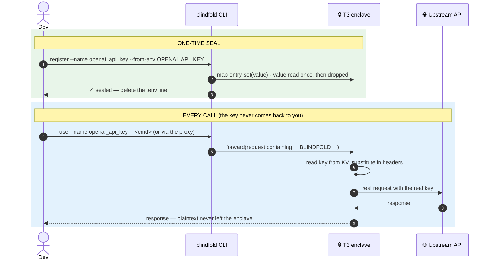

<div align="center">

# ❓ Blindfold FAQ

> **What's new (v0.2 / v0.3 + webhook):** installable global CLI (`npm i -g`, runs from any directory, state in `~/.blindfold`); `blindfold login` stores the tenant key in the **OS keychain** (not a plaintext file); Discord webhook support (release path + `/discord` proxy provider, contract v0.5.5). See `CHANGELOG.md`.


**Real questions, straight answers.** New here? Start with the first three.

### 📖 &nbsp; [Home](README.md) &nbsp;·&nbsp; [Usage Guide](usage.md) &nbsp;·&nbsp; [Examples](EXAMPLES.md) &nbsp;·&nbsp; [Teams](TEAMS.md) &nbsp;·&nbsp; **[FAQ](FAQ.md)** &nbsp;·&nbsp; [Contributing](CONTRIBUTING.md)

</div>

---

## The basics

### What is Blindfold, in one sentence?
A thin wrapper that keeps your AI agent's API keys inside a Terminal 3 (Intel TDX) hardware enclave, so the agent can *use* a key it can never *read* — and therefore can never leak.

### What problem does it actually solve?
Prompt injection. Your agent reads untrusted text (a web page, an email, a PDF) and that text can talk the agent into exfiltrating whatever's in its environment — including `OPENAI_API_KEY`. Env vars, vaults, and guardrails don't fix this structurally; they just move where the key sits or make the leak probabilistic. Blindfold removes the key from the agent's reach entirely.

### How is that different from a secrets manager (Vault, Doppler, AWS Secrets Manager)?
A secrets manager controls *who can fetch* the key — but once your agent fetches it, the plaintext is back in the agent's process, and a prompt injection can read it. Blindfold's agent **never fetches the plaintext at all**; the substitution happens inside the enclave, after the request leaves the agent. Different layer, different threat.

### Is this production-ready?
The core security property is proven on real T3 hardware (sealed keys are used for live API calls — GitHub, DigitalOcean, etc. — with the plaintext never leaving the enclave). It runs on T3 **testnet** today. Treat it as a strong, working reference implementation; do your own review before betting production traffic on the testnet.

---

## Architecture (click any box to jump to the code)

> These diagrams render on GitHub. In the first one, **every box is a link** to the file that implements it — that's the "interactive" part.



**The two lifecycles** — seal once (plaintext touches one function, then is gone), use forever (key never leaves the enclave):



**The one rule that makes it safe:** the only arrow carrying plaintext is the dashed "one-time seal" line (handled by `register.ts`). Every other arrow carries a sentinel or a finished response.

---

## Security

### Can Blindfold itself see my key?
No. There is exactly **one** function in the codebase that ever touches a plaintext value — `register.ts` — and it only passes the value to a single seal call, then drops it. Everywhere else operates on *names*, *sentinels*, or *request shapes*. That's an explicit design invariant (see [CONTRIBUTING.md](CONTRIBUTING.md)).

### Where could the key leak — and why can't it?
| Vector | Answer |
|---|---|
| The agent's `process.env` | The agent only holds the `__BLINDFOLD__` sentinel, never the key. |
| The CLI output / logs | Blindfold prints byte-lengths and fingerprints, never values. |
| The local proxy | It substitutes **inside the enclave** — the proxy process only ever sees the sentinel. |
| The contract's response | Sensitive response headers are stripped before returning. |
| `git` / `.env` | After sealing you delete the `.env` line; `.env` and backups are gitignored. |

### Does the plaintext ever touch my machine?
Depends on the path you choose:
- **In-enclave (`proxy`, `forward`)** — no. The enclave makes the outbound call; the plaintext never reaches your machine.
- **Broker (`blindfold use`, `release()`)** — briefly, for one call, in a process *separate from the agent*. Still safe against prompt injection (the agent never has it); choose the enclave path for zero-trust on the local machine too.

See the comparison table in [EXAMPLES.md §4](EXAMPLES.md#4-secret-never-leaves-the-enclave).

### What does Blindfold NOT protect against?
- A compromised T3 enclave/platform (you're trusting Intel TDX + T3, same as trusting any KMS/HSM vendor).
- An agent that legitimately *uses* the key to do something harmful (Blindfold stops *exfiltration*, not *misuse* — scope your keys and use egress allow-lists).
- Secrets you paste into a prompt yourself.

### Can I verify nothing's been tampered with?
Yes — `blindfold audit`. It checks the local ledger's **tamper-evident hash-chain** (any edited/removed line is detected) and **reconciles against the enclave** (the source of truth), flagging anything missing or drifted.

---

## Getting started

### What's the absolute fastest way to try it?
```bash
git clone https://github.com/FiscalMindset/Blindfold.git && cd Blindfold
npm install
BLINDFOLD_MOCK=1 npm run demo     # side-by-side: agent A leaks, agent B doesn't — no T3 account needed
```

### How do I protect a real key?
```bash
blindfold register --name openai_api_key --from-env OPENAI_API_KEY   # seal it
# delete the OPENAI_API_KEY line from .env — it lives only in the enclave now
blindfold use --name openai_api_key -- <your command>               # use it, no code
```

### I have a whole `.env` full of keys. Do I seal them one by one?
No — `blindfold migrate` seals **all** of them in one command and strips the plaintext (keeping a backup). It skips your T3 creds and config automatically. `blindfold migrate --dry-run` previews first.

### Do I have to write a script (a `.ts` file) for each sealed secret?
**No.** That's a common misconception. The CLI is generic over any secret name — `register`, `use`, `rotate`, `audit` all take `--name <anything>`. You never write per-secret code.

---

## Using sealed secrets

### What are the three ways to use a sealed secret?
1. **No code** — `blindfold use --name X -- <command>` injects it into one subprocess.
2. **One-line SDK swap** — run `blindfold proxy`, set your SDK's key to `__BLINDFOLD__` and base URL to the proxy.
3. **In code** — `const v = await release("X")` for one short-lived call.

Full walkthrough in [EXAMPLES.md](EXAMPLES.md).

### My API uses a weird auth header, not `Authorization: Bearer`. Does that work?
Yes. `blindfold use` injects the secret as an environment variable — *you* put it wherever the API wants it: a Bearer header, a `Token` header (Deepgram), an `x-api-key` header (Anthropic), or a `?key=` query param (Google). See the worked examples in [examples/api-providers/](examples/api-providers/).

### Does the OpenAI/Anthropic quickstart need that provider's key?
Yes — the proxy makes a *real* call to the provider, so you need a real key for that provider sealed, plus a one-time egress grant (`blindfold grant --host api.openai.com`). Each quickstart README lists the exact steps.

### How do I rotate a key?
`blindfold rotate --name X --from-env X`. It shows before/after fingerprints (never the value) so you can confirm it changed; everything that uses that name picks up the new value automatically — no code or config change.

### What if a rotation was a mistake — can I roll back?
Yes. `rotate` automatically snapshots the previous value (as an enclave-side version), so `blindfold rollback --name X` restores the most recent prior value, and `blindfold versions --name X` lists what's available. Fingerprints let you confirm the revert without ever seeing the value.

---

## Teams & operations

### How do teammates use a sealed key without getting the key?
One command: `blindfold share --to <their-agent-did> --host api.openai.com`. It authorizes their agent to **use** the key via the enclave (`forward` only — they never receive the plaintext), scoped to the hosts you list. `blindfold revoke --to <their-agent-did>` removes it instantly. Because nobody holds a raw copy, revocation is total — there's no leaked key to chase. See [TEAMS.md](TEAMS.md).

### How do I audit what's sealed and prove it's intact?
`blindfold status` for a quick inventory; `blindfold audit` for the integrity + enclave-reconciliation check. Neither ever prints a value.

### Everything suddenly returns HTTP 500. What do I do?
Run `blindfold doctor` first — it does a live check and tells you the actual cause in plain English:
- **Unprovisioned key** (500 even on a read) → switch to a key whose tenant is active, or ask T3 to provision one.
- **Out of credits** (403) → request testnet credits.
- **DID mismatch** → your `.env` `DID` isn't this key's server-assigned tenant; doctor prints the correct one.
- **The node itself is unhealthy** → set `T3_BASE_URL=<healthy-node-url>` to route around it.

> This exact diagnosis used to take *days* by hand — the #1 cause was an API key with no provisioned tenant, which the server reports only as a bare 500.

### Why did my key work on one machine but not another?
A T3 API key only works if the server has an **active tenant provisioned** for it, and the tenant DID is **server-assigned** (not derived from the key's address). Put the key *and* its real DID (from `blindfold doctor` / `me()`) in `.env`.

---

## Performance, limits & compatibility

### Does Blindfold add latency?
Yes — one extra hop. Each call goes through the enclave instead of straight to the provider, so expect added round-trip latency per request (the enclave does the substitution and the outbound call). For most agent workloads (already network- and model-bound) it's negligible; for ultra-latency-sensitive paths, measure first.

### Can I protect multiple providers at once?
Yes. Seal each key under its own name (`openai_api_key`, `anthropic_api_key`, …). The proxy maps paths per provider (`/v1/` → OpenAI, `/anthropic/` → Anthropic, `/x/` → xAI, `/groq/` → Groq), and `blindfold use` works for any tool regardless of provider.

### Does it work with streaming responses (SSE / token streaming)?
The proxy currently returns the full upstream response (the enclave's `http.response` is a status + payload, no streaming). Token-by-token streaming through the enclave is a known limitation — use the broker path (`release()`) with the provider's native streaming if you need it today.

### What languages and SDKs are supported?
- **Any tool / language** via `blindfold use` (it just sets an env var).
- **Any HTTP SDK** via the proxy + `__BLINDFOLD__` sentinel (one-line base-URL swap).
- **TypeScript/JS** also have `release()` and `wrap()` for in-code use. (A Python `release()` is on the roadmap.)

### Is there a cost?
T3 runs on credits (testnet credits are free to request). Writes (seal, publish, grant) and contract executes consume credits; reads are cheap. `blindfold doctor` flags an out-of-credit tenant (403) explicitly.

### Where does my key physically live (for compliance)?
Only inside the Intel TDX enclave on Terminal 3's infrastructure, sealed to your tenant's `secrets` map. It is never written to your disk, your logs, or your git history. You're extending trust to Intel TDX + T3 — the same shape as trusting a KMS/HSM vendor.

### Can I self-host the enclave?
The enclave is the T3 platform; Blindfold is the client + contract on top of it. Self-hosting the confidential-compute layer is out of scope for this project (it's T3's domain).

---

## Mode & mechanics

### What's MOCK mode?
`BLINDFOLD_MOCK=1` simulates all T3 calls locally — used by the demo and CI so they run with **no T3 account**. It never makes real calls and never holds real secrets. REAL mode is the default; missing creds produce a loud error, never a silent fallback.

### Does the contract really make the call from inside the enclave?
Yes. `forward()` substitutes the sealed secret and calls `http::call` inside TDX. Verified end-to-end: a request through the proxy reaches OpenAI/GitHub/DigitalOcean and returns a real response, with the plaintext never leaving the enclave (`scripts/test-enclave-egress.ts`).

### What's the `__BLINDFOLD__` sentinel?
A placeholder string your agent uses *instead* of the real key. The enclave replaces every occurrence of it in the outbound request's headers with the real secret. If your agent is tricked into leaking its key, it leaks this worthless string.

---

## Still stuck?

- **[Usage Guide](usage.md)** — scenario-by-scenario.
- **[Examples](EXAMPLES.md)** — copy-paste, with real output.
- **`blindfold doctor`** — diagnoses most problems in one command.
- Open an issue (no secrets, please — see the security policy in [CONTRIBUTING.md](CONTRIBUTING.md)).
