<div align="center">

# 🏗️ Blindfold — System Design

**How an API key gets used without ever being held.**

[Home](README.md) · [Architecture](ARCHITECTURE.md) · [Usage](usage.md) · [FAQ](FAQ.md) · [Security](SECURITY.md)

</div>

> **The whole system in one sentence:** the developer seals a secret into a
> Terminal 3 **TDX enclave** once; from then on the agent sends a placeholder
> (`__BLINDFOLD__`), and the real key is substituted **inside the enclave**, at
> the last moment — so it is never present in the agent's process, memory, logs,
> or shell history.

<details open>
<summary><b>📑 Contents</b></summary>
<br/>

<table>
<tr>
<td valign="top" width="33%">

**Big picture**
- [1 · System context](#1--system-context)
- [2 · Component architecture](#2--component-architecture)
- [3 · The core trick](#3--the-core-trick-sentinel-substitution)

</td>
<td valign="top" width="33%">

**The flows**
- [4 · Three secret paths](#4--the-three-secret-paths)
- [5 · Self-serve signup](#5--self-serve-signup)
- [6 · Attestation](#6--remote-attestation)

</td>
<td valign="top" width="33%">

**Guarantees & internals**
- [7 · Trust boundaries](#7--trust-boundaries--threat-model)
- [8 · Tamper-evident ledger](#8--tamper-evident-ledger)
- [9 · Secret lifecycle](#9--secret-lifecycle)
- [10 · Deployment & files](#10--deployment--file-map)

</td>
</tr>
</table>

</details>

---

## 1 · System context

Who talks to whom. The **agent never touches the real key** — it only ever holds
the sentinel. The one component that briefly handles plaintext (registration) is
isolated, and the enclave is the only place the canonical secret lives.

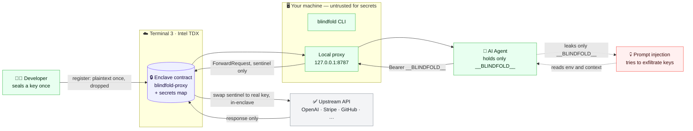

**Key idea:** everything on *your machine* is treated as untrusted for secrets.
The real key crosses one boundary — into the enclave at registration — and is
substituted back in only *inside* the enclave, never on the way out.

---

## 2 · Component architecture

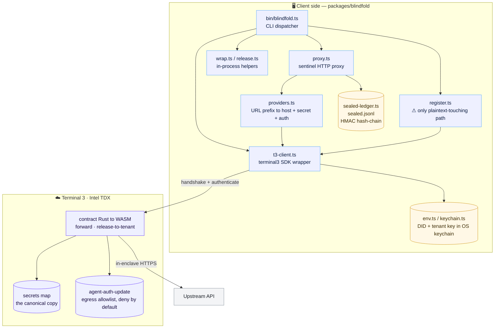

<details>
<summary><b>Component responsibilities (table)</b></summary>

| Component | File | Responsibility | Sees plaintext? |
|---|---|---|---|
| CLI dispatcher | `bin/blindfold.ts` | route commands to `cmd-*.ts` handlers | no |
| Register | `src/register.ts` | seal a secret with one `map-entry-set` | **once**, dropped immediately |
| Proxy | `src/proxy.ts` | swap any `Authorization` for `Bearer __BLINDFOLD__`, route by URL, forward to enclave | **no** |
| Providers | `src/providers.ts` | prefix → upstream host + secret name + auth scheme | no |
| T3 client | `src/t3-client.ts` | SDK wrapper: auth, `seedSecret`, `invokeForward`, `releaseSecret`, `deleteSecret`, `getBalance` | release path returns it locally |
| Release / wrap | `src/release.ts`, `src/wrap.ts` | broker plaintext to *your* process for one call | **yes**, by design (local) |
| Ledger | `src/sealed-ledger.ts` | metadata-only, HMAC-chained record of what's sealed | never (metadata only) |
| Contract | `contract/src/forward.rs` | `forward` substitutes in-enclave; `release-to-tenant` returns plaintext | inside the enclave only |

</details>

---

## 3 · The core trick: sentinel substitution

The agent sends `Authorization: Bearer __BLINDFOLD__`. The proxy figures out
*which* API and *which* sealed secret from the **URL path**, and the enclave
swaps the sentinel for the real key at the very last moment.

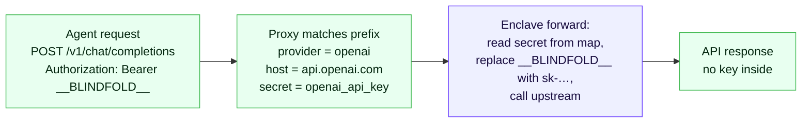

> **Deny-by-default, twice:** a URL prefix not in `providers.ts` returns `404 no
> upstream mapping`; and the enclave refuses any host not on the tenant's egress
> allowlist (`grant --host …`). Two independent gates.

---

## 4 · The three secret paths

Blindfold has **three** ways a sealed secret gets used, with different security
postures. Pick per workload — see [Cost](README.md#cost).

| Path | Where the plaintext appears | Guarantee | Use for |
|---|---|---|---|
| **Proxy / forward** | *only inside the enclave* | strongest — agent never holds it | agent HTTP calls, autonomous agents |
| **Release broker** | *your local process*, briefly | protects the agent's *context*, not your process | CLI `use`, non-HTTP, batch (release-once-reuse) |
| **Seed / register** | *your process once*, at seal time | unavoidable — the value must enter the enclave once | one-time setup |

<details open>
<summary><b>4a · Proxy / forward — the un-leakable path</b></summary>

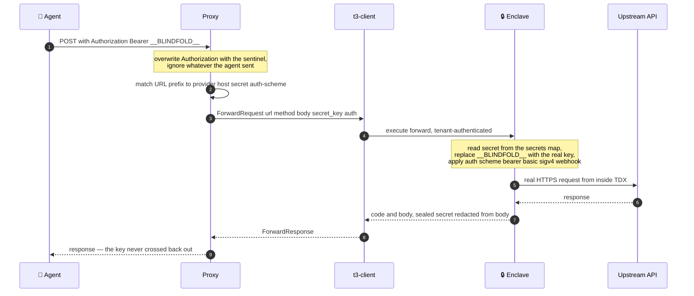

The plaintext key exists **only** inside the enclave, for one outbound call. The
agent, proxy, and `t3-client` only ever handle the sentinel.

</details>

<details>
<summary><b>4b · Release broker — plaintext to your process</b></summary>

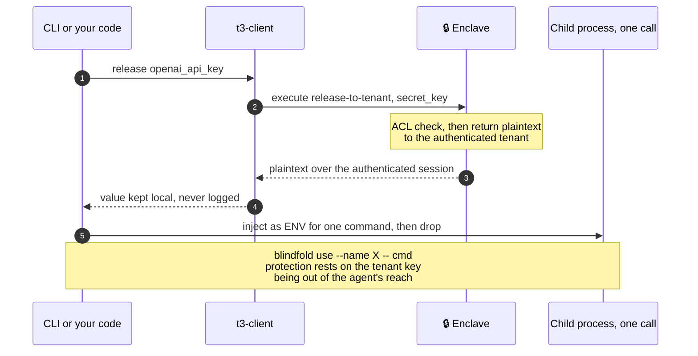

Used by `use`, `export`, `rotate`, `rollback`, and `wrap`/`release`. Cheaper for
bursts — **release once, reuse for N calls** — at the cost of the value living in
your process for that window.

</details>

<details>
<summary><b>4c · Seal / register — one-time</b></summary>

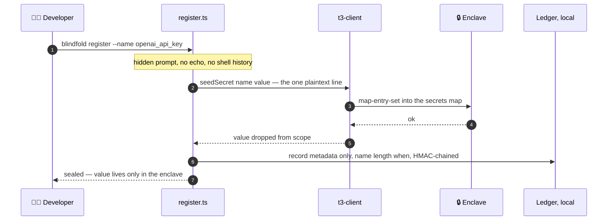

</details>

---

## 5 · Self-serve signup

`blindfold signup` provisions a funded Terminal 3 testnet tenant with no manual
step — the tenant key is generated **locally** and never leaves the machine
except to authenticate.

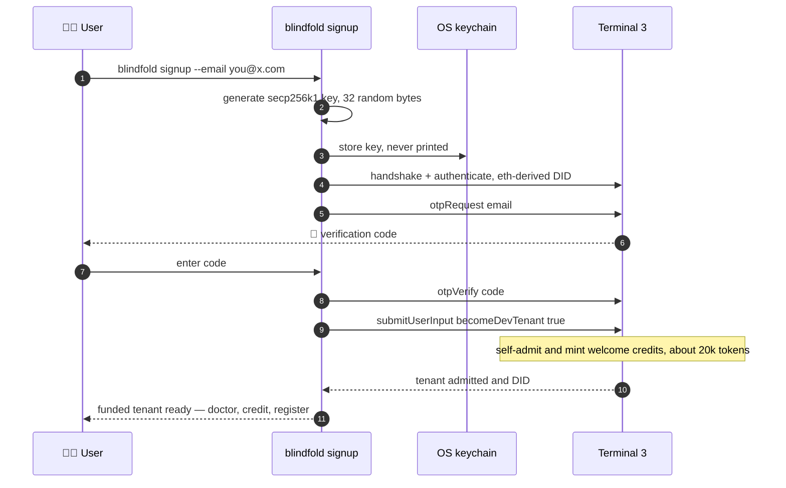

---

## 6 · Remote attestation

`blindfold attest` proves the enclave runs the **expected code** before you trust
it with secrets. Quotes chain to Intel's SGX root CA; the code measurement
`RTMR3` can be pinned so `seal`/`proxy` verify it first.

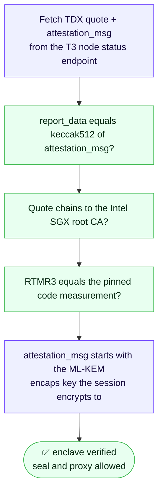

> **Why it binds:** seals encrypt through the authenticated session derived from
> the same status ML-KEM key that attestation binds to — so the attested key *is*
> the seal-recipient key. Pinning `RTMR3` closes the residual "is it my code?"
> question.

---

## 7 · Trust boundaries & threat model

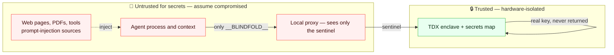

| Threat | Mitigation | Residual |
|---|---|---|
| Prompt injection exfiltrates a key | agent only ever holds `__BLINDFOLD__` | none for the proxy path |
| Proxy misused by a co-resident process | `proxy --auth` session token · `--socket` 0600 | agent as same OS user |
| Reflection-exfil — key echoed in a response | contract redacts the sealed secret from the returned body | — |
| Malicious or honest-but-curious T3 node | remote attestation + **mandatory RTMR3 pin** to seal | trust in Intel TDX + T3 |
| Tenant key stolen from disk | key in the **OS keychain**, not a plaintext file | agent as same user with unlocked keychain |
| Ledger edited to hide a secret | HMAC hash-chain, `audit` flags TAMPERED; enclave is source of truth | — |

---

## 8 · Tamper-evident ledger

`~/.blindfold/sealed.jsonl` is a metadata-only, append-only, HMAC hash-chained
record of what's sealed. It never holds values — `audit` reconciles it against
the enclave, the source of truth.

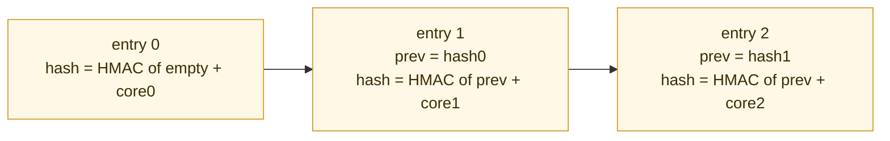

- **Keyed** — `ledger.key`, 0600 — an attacker who edits a line can't forge a
  valid chain (unlike a plain sha256 chain anyone could recompute).
- **`blindfold delete`** removes an entry and **re-chains** the survivors (backup
  kept) so the chain stays valid — a legitimate owner action, not a stealth edit.
- **`blindfold audit`** verifies the chain *and* reconciles each name against the
  enclave: present / drift / missing.

---

## 9 · Secret lifecycle

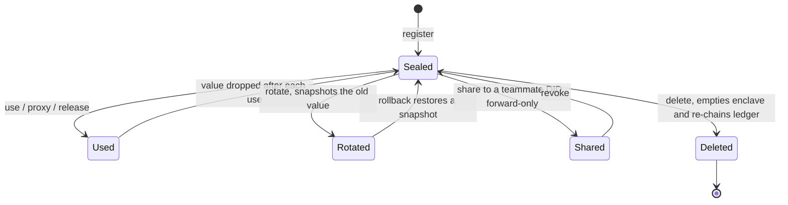

---

## 10 · Deployment & file map

| Concern | Where it lives |
|---|---|
| Canonical secret value | **only** the TDX enclave secrets map |
| Tenant key (`T3N_API_KEY`) | OS keychain — macOS `security` / Linux `secret-tool` / Windows Cred Mgr; 0600 file fallback |
| DID + settings | `~/.blindfold/config.json` — 0600, non-secret |
| Sealed-keys ledger + HMAC key | `~/.blindfold/sealed.jsonl` + `ledger.key`, 0600 |
| Egress allowlist | server-side on T3 (`agent-auth-update`) — **not** client-bypassable |
| The contract | `contract/` → Rust → `wasm32-wasip2` WASM, published as `blindfold-proxy` v0.5.6 |
| The CLI | published npm `@fiscalmindset/blindfold` → `dist/cli.mjs` |

```
packages/blindfold/
  bin/     blindfold.ts (dispatch) + cmd-*.ts (command groups)
  src/     proxy.ts · t3-client.ts · register.ts · release.ts · wrap.ts
           providers.ts · sealed-ledger.ts · attest.ts · env.ts · keychain.ts
           help.ts · tui.ts (responsive terminal UI)
contract/
  src/     lib.rs · forward.rs  (forward + release-to-tenant)
  wit/     world.wit            (exports + host imports)
```

---

<div align="center">

**Read next:** [Architecture writeup](ARCHITECTURE.md) · [Security model](SECURITY.md) · [Cost model](README.md#cost) · [Usage](usage.md)

<sub>Diagrams render natively on GitHub (Mermaid). Collapsible sections keep it scannable.</sub>

</div>
